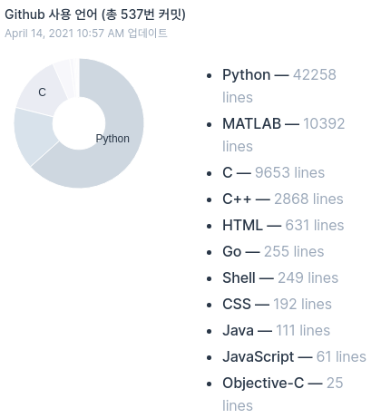

ML/DL, 특히 computer vision에 관심이 있는 학생입니다.  
Attention, NLP 등에도 관심이 있습니다.

Electricity and information engineering 과 computer engineering 계열을 복수전공하고 있습니다.

## AI Competitions

|Name|Type|Date|Rank|
|---|---|---|---|
|<a href="https://dacon.io/competitions/official/235717" target="_blank"><b>로그 분석을 통한 보안 위험도 예측 AI 경진대회</b></a>|Text Anomaly Detection|21.04~21.05|2/152,우승|
|<a href="https://dacon.io/competitions/official/235701" target="_blank"><b>모션 키포인트 검출 AI 경진대회</b></a>|PoseEstimation|21.02~21.04|1/156,우승|
|<a href="https://dacon.io/competitions/official/235689" target="_blank">운동 동작 분류 AI 경진대회</a>|Timeseries Classification|21.01~21.02|21/336, Top 6%|
|<a href="https://dacon.io/competitions/official/235697" target="_blank">제 2회 컴퓨터 비전 학습 경진대회</a>|Image Classification|21.01~21.03|30/216, Top 13%|
|<a href="https://programmers.co.kr/competitions/747/2021-seoultech-cse-challenge" target="_blank"><b>정보통신대학 ICT AI 및 알고리즘 경진대회</b></a>|Text Classification|21.01~21.01|1위, 정보통신대학장상|
|<a href="https://dacon.io/competitions/official/235680" target="_blank">태양광 발전량 예측 AI 경진대회</a>|Timeseries Forecasting|20.12~21.01|94/461, Top 20%|
|<a href="https://dacon.io/competitions/official/235646" target="_blank">공공데이터 활용 수력 댐 강우예측 AI 경진대회</a>|Image Forecasting|20.10~20.11|39/132, Top 29%|
|<a href="https://dacon.io/competitions/official/235626" target="_blank"><b>컴퓨터 비전 학습 경진대회</b></a>|Image Classification|20.08~20.09|11/356, Top 3%|
|<a href="https://campaign.naver.com/airush/" target="_blank">NAVER AI-RUSH 2020</a>|Image Classification|20.07~20.07|37위|
|<a href="https://dacon.io/competitions/official/235591" target="_blank">위성관측 데이터 활용 강수량 산출 AI 경진대회</a>|Image Regression|20.04~20.05|72/213, Top 33%|

* Currently interested in "[BirdCLEF 2021 - Birdcall Identification(Kaggle)](https://www.kaggle.com/c/birdclef-2021)", "[동서발전 태양광 발전량 예측 AI 경진대회(Dacon)](https://dacon.io/competitions/official/235720)"

<!--
  
From 2020.12.28.
-->

<!--

-->

